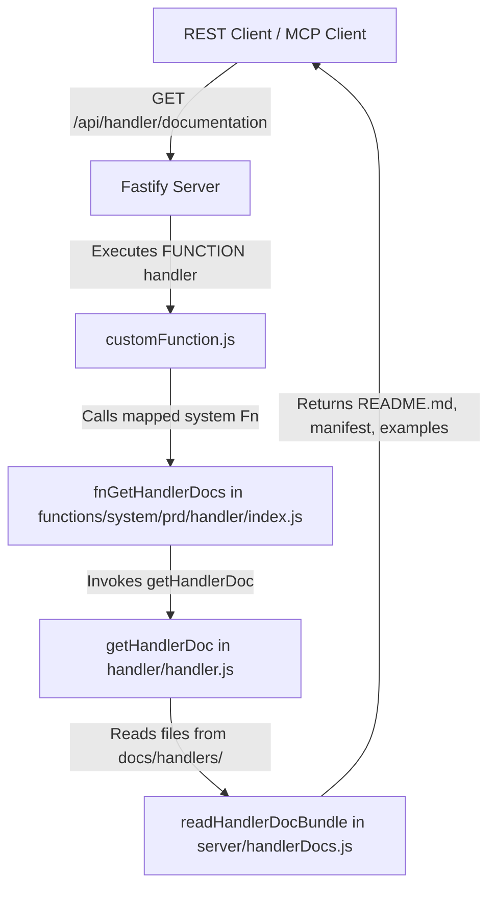

# OpenFusionAPI Documentation Architecture Report

This report outlines the architecture and execution flow of the documentation system in **OpenFusionAPI**, specifically focusing on how documentation is loaded, structured, and exposed to both humans and AI agents (via REST and MCP tools).

---

## 📂 1. Directory Structure & Source of Truth

The documentation for all endpoint handlers is centralized under the `docs/` folder at the project root.

```
docs/
├── README.md                              # High-level entry point and documentation overview
├── DOCUMENTATION_SYSTEM_REPORT.md         # This architectural overview report for agents
├── templates/
│   └── EXTERNAL_DEPENDENCY_DOC_TEMPLATE.md# Formatting guide for documenting external libraries
├── dependencies/
│   └── uFetch.md                          # Concrete guide for the @rdsslab/uFetch package
└── handlers/
    ├── README.md                          # Table of active handlers and summary of rules
    ├── FETCH/
    ├── FUNCTION/
    ├── HANA/
    ├── JS/
    ├── MCP/
    ├── MONGODB/
    ├── NA/
    ├── SOAP/
    ├── SQL/
    ├── SQL_BULK_I/
    ├── TELEGRAM_BOT/
    └── TEXT/
```

### 📄 Per-Handler Documentation Contract
Every active handler directory inside `docs/handlers/` must follow this structure:
1.  **`README.md`**: The canonical human guide containing syntax rules, available variables, execution context, and setup examples.
2.  **`manifest.json`**: Structured metadata used by system endpoints, tooling, and runtime document engines. Contains properties like `handler` name, `label`, `status`, `summary`, and schema mappings for `code` and `custom_data`.
3.  **`api.generated.md`** *(optional)*: Automatically generated reference files for runtime helper modules or APIs.
4.  **`examples.md` or `examples.json` *(optional)***: Real-world payloads and workflow examples.

---

## 🛠️ 2. Database Seeds & System Endpoints

OpenFusionAPI utilizes database seeds (defined in JavaScript) to set up default applications, variables, and system administration endpoints on startup.

- **File Path**: [system.js](../src/lib/db/default/system.js)
- **Startup Seeding**: [app.js](../src/lib/db/app.js) reads `default_apps` (which includes `system_app` from `system.js`) and runs `restoreAppFromBackup(app)` during startup.
- **Key System Endpoint**: The `/api/handler/documentation` endpoint is defined inside the seed with:
  - `"handler": "FUNCTION"`
  - `"code": "fnGetHandlerDocs"` (System function name)
  - `"mcp.enabled": true` (Triggers automatic exposure as an MCP tool named `handler_documentation`)

---

## 🔄 3. Runtime Documentation Loading Flow

When a client or agent requests documentation for a handler (either via HTTP `GET /api/handler/documentation?handler=JS` or via MCP `handler_documentation(handler="JS")`), the request is resolved as follows:



### Key Files Involved:
1.  **[customFunction.js](../src/lib/handler/customFunction.js)**: Executes system endpoints whose handler is set to `FUNCTION`. Maps the endpoint `code` string (`fnGetHandlerDocs`) to its actual Javascript execution pointer.
2.  **[index.js](../src/lib/server/functions/system/prd/handler/index.js)**: Contains `fnGetHandlerDocs(params)` which delegates file reading to `getHandlerDoc(params.request.query.handler)`.
3.  **[handler.js](../src/lib/handler/handler.js)**: Exposes `getHandlerDoc(handler)` that calls the loader and structures the response object containing `label`, `description`, `markdown`, `manifest`, `generated`, `examples`, and `files`.
4.  **[handlerDocs.js](../src/lib/server/handlerDocs.js)**: Exposes `readHandlerDocBundle(handler)`. Resolves the path `docs/handlers/<HANDLER_NAME>` dynamically and loads `README.md` and `manifest.json`. It also reads any additional files listed in the manifest or matching `*.generated.md` / `examples.*`.

---

## 🤖 4. Exposing Documentation to AI Agents (MCP Integration)

When an application is configured to run as an MCP server, endpoints are dynamically mapped to MCP tools.

- **File Path**: [mcp.js](../src/lib/server/endpoint/handlerBuild/mcp.js)
- **Filtering Rule**:
  In `CreateMCPHandler`, endpoints are filtered to be exposed as tools:
  ```javascript
  let mcp_endpoint_tools = app.endpoints.filter((endpoint) => {
    return (
      endpoint.method != "WS" &&
      endpoint.handler != "MCP" &&
      endpoint?.mcp?.enabled
    );
  });
  ```
- **Discovery Tools & Resources**:
  - `list_api_endpoints_catalog_<app_name>`: Lightweight catalog returning markdown tables of endpoints (method, path, handler, title).
  - `list_api_endpoints_<app_name>`: Full documentation dump of all endpoints (including raw schemas, descriptions, and examples).
  - `api-docs-<app_name>` and `api-docs-catalog-<app_name>`: Exposed as standard MCP Resources returning the same markdown dumps.

---

## ⚡ 5. Active Handlers Summary

Below is a cheat sheet of the 12 active handlers defined in [handler.js](../src/lib/handler/handler.js):

| Handler | Label | Target Code Location | Purpose / Description |
|---|---|---|---|
| **JS** | JavaScript | Sandboxed JS String | Runs Node.js scripts in a VM sandbox. Assigns response to `$_RETURN_DATA_`. |
| **SQL** | SQL | SQL Query String | Runs raw SQL queries via Sequelize. Safe parameter binding via `$param` (bind) or `:param` (replacements). |
| **FETCH** | Fetch | Upstream HTTP URL | Acts as an HTTP proxy/forwarder. Integrates `@rdsslab/uFetch`. |
| **TEXT** | Text | Static string value | Delivers static text/files up to 1MB. Set `mimeType` in `custom_data`. |
| **SOAP** | SOAP | Target SOAP URL | Proxies REST requests to legacy SOAP Web Services using WSDL description. |
| **SQL_BULK_I** | SQL Bulk Insert | Target Table Name | Performs highly efficient bulk insertions of JSON arrays into DB. |
| **HANA** | HANA | SAP HANA SQL Query | Executes queries on SAP HANA databases via `@sap/hana-client`. |
| **FUNCTION** | Function | System Function Name | Runs pre-compiled native JS functions registered on the server. |
| **MONGODB** | MongoDB | Mongo Query Object | Connects to MongoDB, supports query pipelines and JS execution. |
| **MCP** | MCP | Configuration payload | Spins up an MCP server to expose app endpoints as tools/resources. |
| **TELEGRAM_BOT**| Telegram Bot | Bot event handler JS | Manages a Telegram Bot wrapper, executing JS handler on bot updates. |
| **NA** | Not Assigned | Fallback string | Internal fallback/no-op route (behaves as TEXT). |

---

## 📦 6. Handler-Specific Creation Wrappers

Instead of using the generic `endpoint_upsert` tool directly, AI agents should use the specialized system wrapper endpoints seeded in `system.js`. This guarantees that the handler-specific inputs are properly validated and structured before saving:

1.  **`upsert_js_endpoint_handler`** (Handler: `JS`, edits `js_code`)
2.  **`upsert_sql_endpoint_handler`** (Handler: `SQL`, database credentials inside `custom_data` or referenced by AppVar)
3.  **`upsert_fetch_endpoint_handler`** (Handler: `FETCH`, target URL in code)
4.  **`upsert_text_endpoint_handler`** (Handler: `TEXT`, static code, mimetype in `custom_data`)
5.  **`upsert_mongodb_endpoint_handler`** (Handler: `MONGODB`)
6.  **`upsert_hana_endpoint_handler`** (Handler: `HANA`)
7.  **`upsert_soap_endpoint_handler`** (Handler: `SOAP`)
8.  **`upsert_sql_bulk_i_endpoint_handler`** (Handler: `SQL_BULK_I`)
