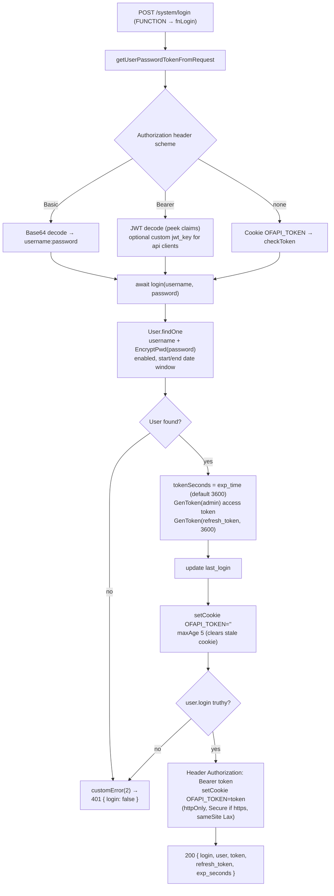
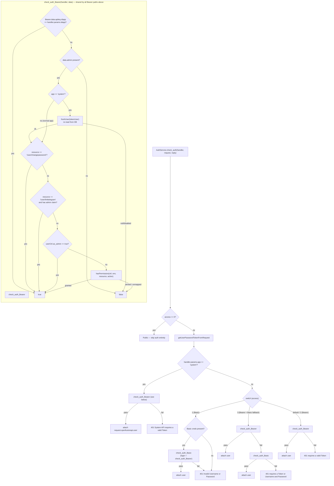
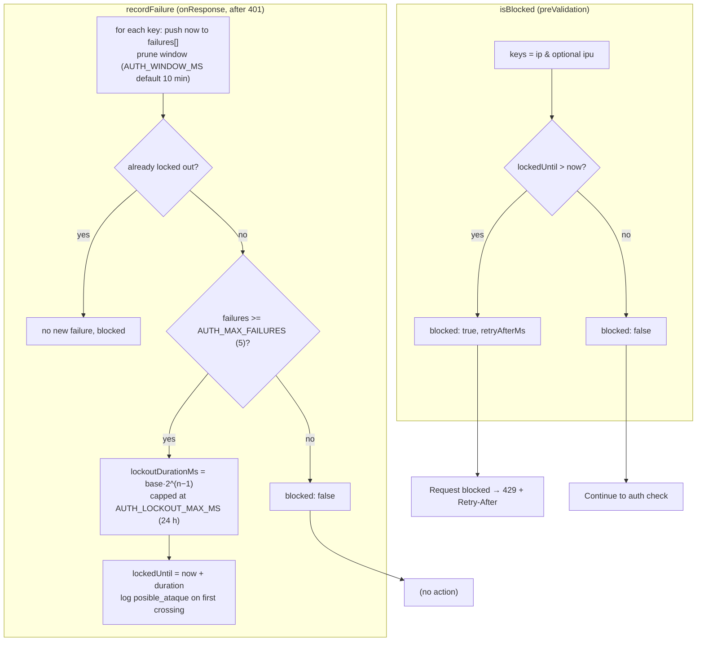
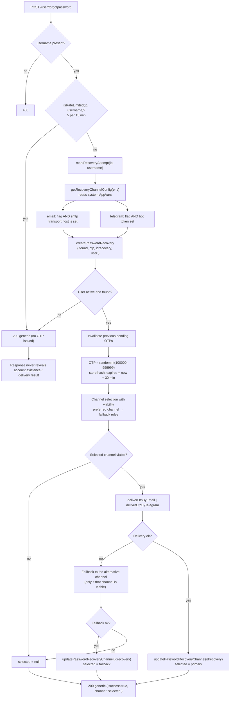
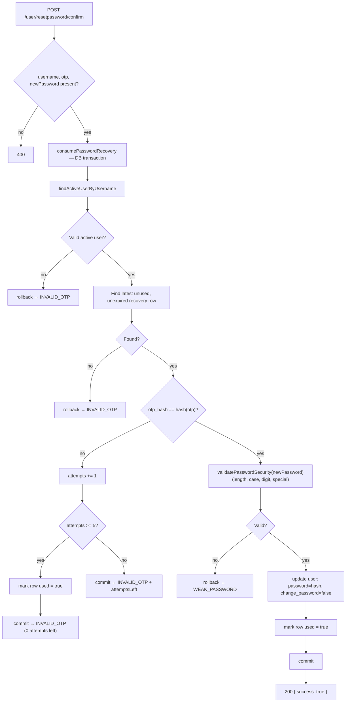
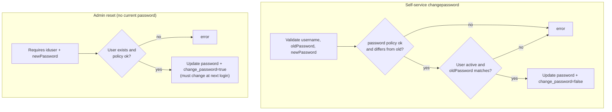
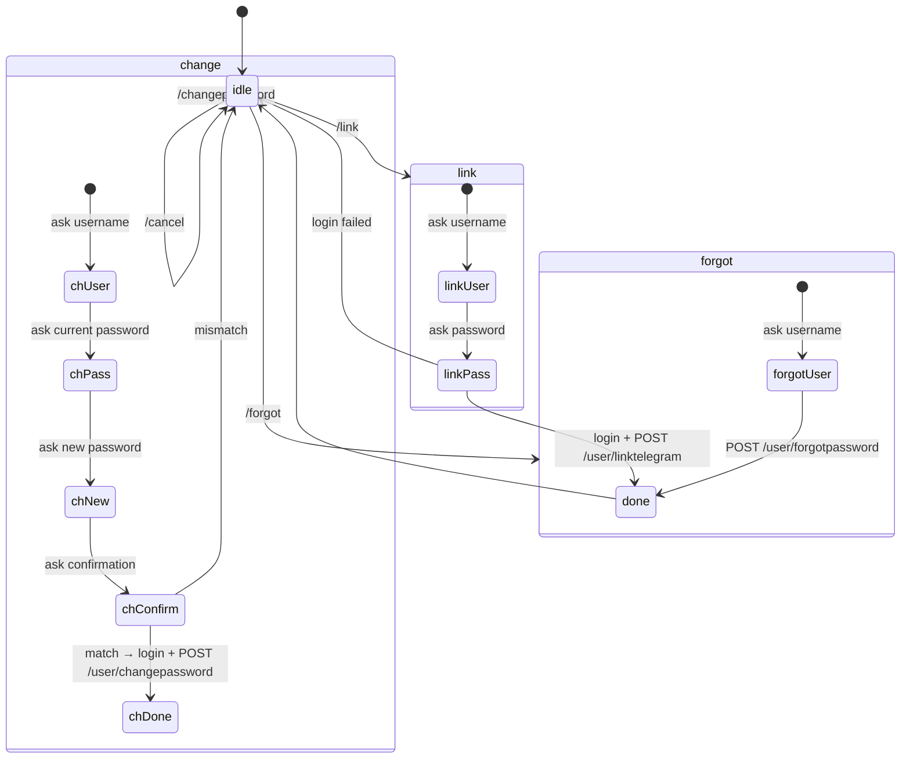

# Authentication & User Flows

- [1. Login (`/system/login`)](#1-login--systemlogin)
- [2. Access decision by `access` level](#2-access-decision-by-access-level)
- [3. Authentication rate limiting (brute-force)](#3-authentication-rate-limiting-brute-force)
- [4. Password recovery — request OTP (`/user/forgotpassword`)](#4-password-recovery--request-otp)
- [5. Password recovery — redeem OTP (`/user/resetpassword/confirm`)](#5-password-recovery--redeem-otp)
- [6. Change & reset password](#6-change--reset-password)
- [7. Telegram recovery bot — conversation state machine](#7-telegram-recovery-bot--conversation-state-machine)

Source references: `src/lib/server/auth.js`, `src/lib/server/auth_service.js`,
`src/lib/server/runtime/RateLimitService.js`, `src/lib/db/user.js`,
`src/lib/server/functions/system/prd/user/*`. Human guide: [../auth/USER_RECOVERY.md](../auth/USER_RECOVERY.md).

---

## 1. Login (`/system/login`)

> `change_password` is returned in the user payload (it is **not** enforced server-side on
> login); the client is expected to force the change flow when `true`.

---

## 2. Access decision by `access` level

---

## 3. Authentication rate limiting (brute-force)

In-memory sliding window, per IP and per IP+username. Read in `preValidation`, written from
`onResponse` when a request ends with 401.

Configuration env vars (with defaults): `AUTH_MAX_FAILURES=5`, `AUTH_WINDOW_MS=600000`,
`AUTH_LOCKOUT_BASE_MS=5000`, `AUTH_LOCKOUT_MAX_MS=86400000`, `AUTH_PRUNING_AGE_MS=86400000`.

---

## 4. Password recovery — request OTP (`/user/forgotpassword`)

---

## 5. Password recovery — redeem OTP (`/user/resetpassword/confirm`)

---

## 6. Change & reset password

Two distinct flows:

- **Self-service** (`/user/changepassword`, any authenticated user): validates the current
  password, requires the new one to differ, clears `change_password`.
- **Admin reset** (`/user/resetpassword`, bearer + ctrl permission): no current password
  required; assigns a temporary password and sets `change_password = true`.

---

## 7. Telegram recovery bot — conversation state machine

The **Recovery Password Bot** is stateless (in-memory `Map` of chat → step). It authenticates
against the server and calls the internal endpoints with `uFetchAutoEnv`.

> If `$_VAR_RESET_TELEGRAM_ENABLED = false` the bot still responds, but the server decides the
> delivery — so no Telegram OTP is produced.