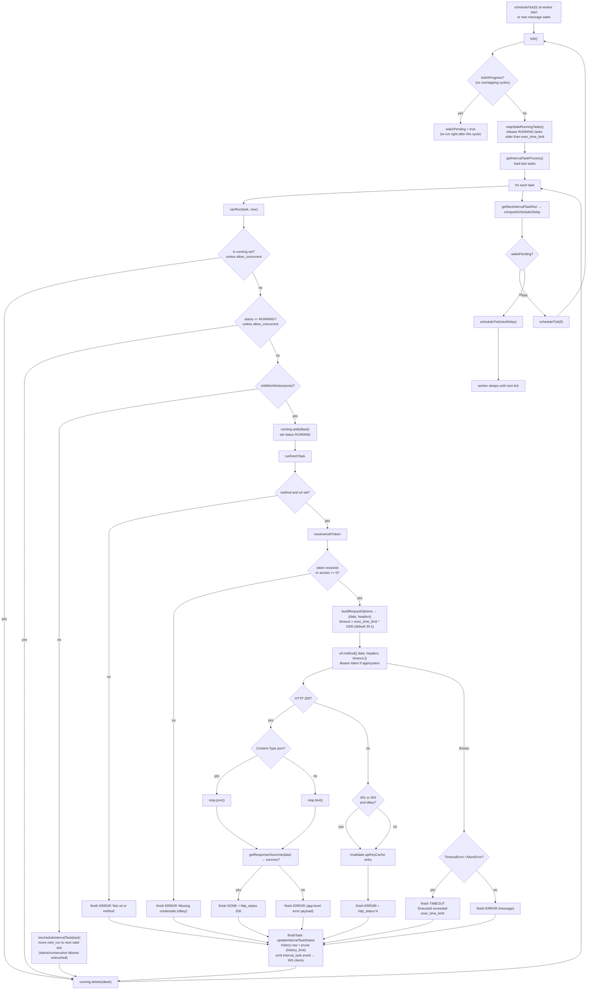
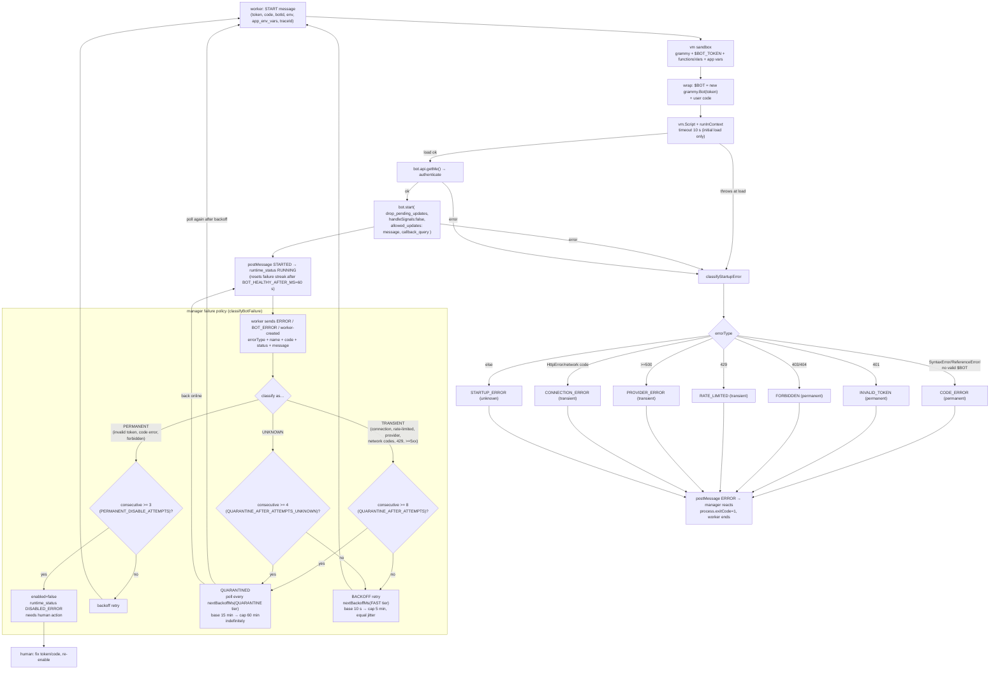

# Background Flows

- [1. Interval-task scheduler worker](#1-interval-task-scheduler-worker)
- [2. Bot lifecycle (Telegram, worker + failure policy)](#2-bot-lifecycle-telegram-worker--failure-policy)

Source references: `src/lib/timer/worker.js`, `src/lib/timer/schedule.js`,
`src/lib/timer/tasks.js`, `src/lib/server/bot-manager/manager.js`,
`src/lib/server/bot-manager/worker.js`, `src/lib/server/bot-manager/failurePolicy.js`.

---

## 1. Interval-task scheduler worker

Runs in a worker thread. It self-schedules the next tick from the next due task in DB instead
of a fixed interval, so idle systems do not poll in a tight loop.

Logging is done through a `LogBuffer` that flushes every 10 s (batch 100, buffer cap 200).

---

## 2. Bot lifecycle (Telegram, worker + failure policy)

Each bot runs in its own worker thread. The manager starts/stops workers; the worker loads user
code in a VM sandbox, validates the token with `getMe()`, and reports failure signals. The
manager classifies failures and decides **retry vs. quarantine vs. disable**.

Runtime states (`ofapi_bot.runtime_status`): `STOPPED → STARTING → RUNNING`, plus
`BACKOFF`, `QUARANTINED`, `DISABLED_ERROR`. `enabled` is the user's intent: recoverable
failures never flip it; only persistent permanent failures do. During an outage the manager
holds every retry at the FAST cap (~5 min) until the connection returns.