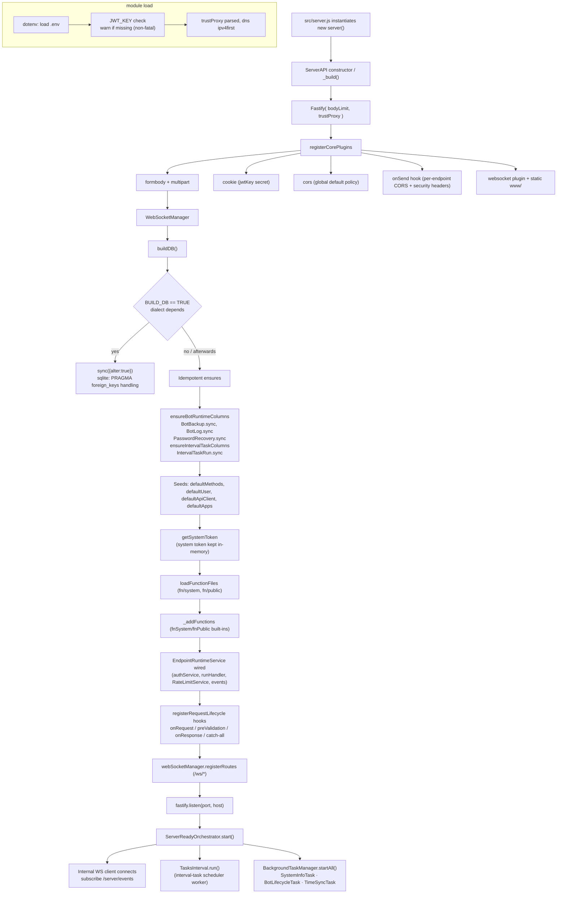
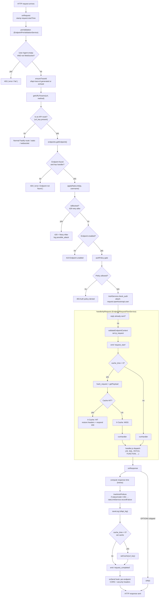
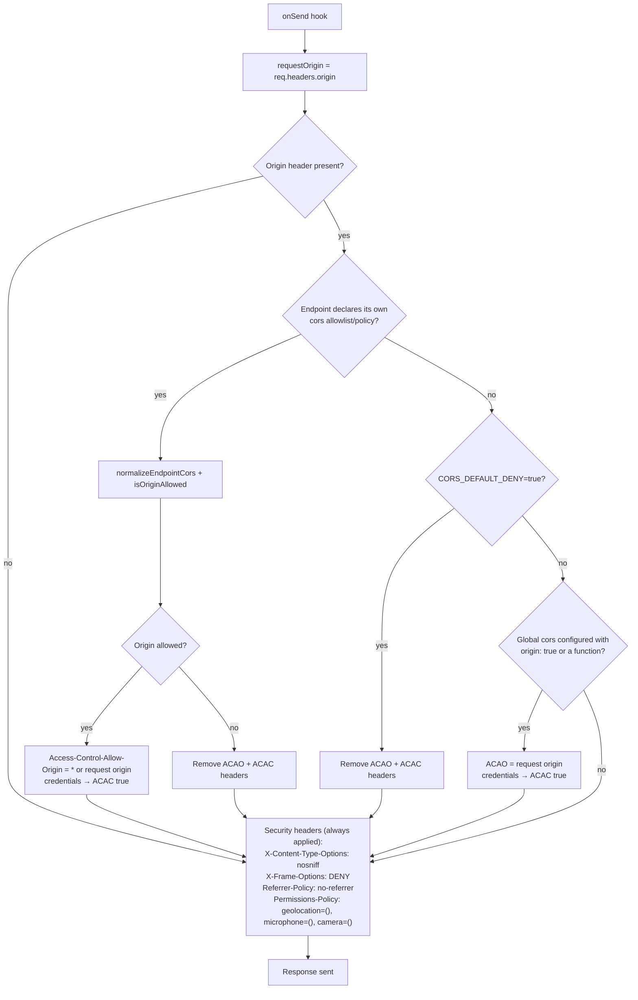

# Platform Flows

- [1. Server boot](#1-server-boot)
- [2. HTTP request lifecycle](#2-http-request-lifecycle)
- [3. Per-endpoint CORS & security headers](#3-per-endpoint-cors--security-headers)

Source references: boot in `src/lib/index.js`, request lifecycle in
`src/lib/server/runtime/*`, CORS/headers in `src/lib/server/runtime/registerCorePlugins.js`.

---

## 1. Server boot

---

## 2. HTTP request lifecycle

---

## 3. Per-endpoint CORS & security headers

Applies on every response in the `onSend` hook.

