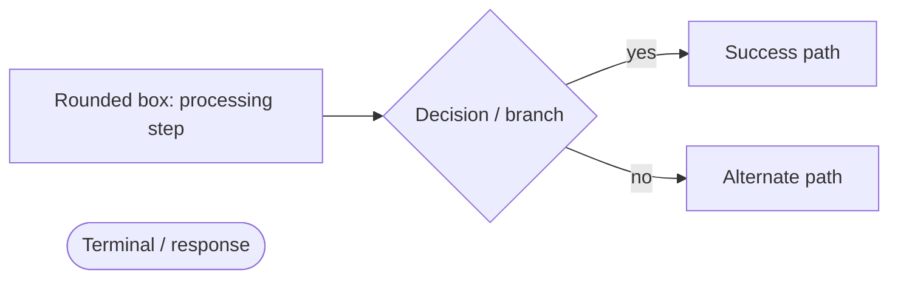

# OpenFusionAPI Flows (internal processes)

This section contains **Mermaid diagrams** of the platform's internal processes, oriented to
**human readers** (developers and operators). The diagrams help visualize how the server boots,
how an HTTP request travels through the runtime, how authentication, recovery, caching, MCP and
the background workers behave.

> **For AI agents:** this section is intentionally **not** exposed through any MCP tool or
> skill, and the diagrams are not inlined into `AI_SKILL.md` files to avoid unnecessary token
> consumption. Agents should rely on the REST/MCP contract and the `AI_SKILL.md` guides
> instead. See [../DOCUMENTATION_SYSTEM_REPORT.md](../DOCUMENTATION_SYSTEM_REPORT.md).

## Index by domain

| File | Topics |
|---|---|
| [PLATFORM.md](./PLATFORM.md) | Server boot · HTTP request lifecycle · Per-endpoint CORS & security headers |
| [AUTH.md](./AUTH.md) | Login · Access decision (Basic/Bearer/API key) · Auth rate limiting · Password recovery OTP |
| [RUNTIME.md](./RUNTIME.md) | Handler dispatch · Cache · JS sandbox · MCP handler invocation |
| [REALTIME.md](./REALTIME.md) | WebSocket protocol · Server events pushed to subscribers |
| [BACKGROUND.md](./BACKGROUND.md) | Interval-task scheduler · Bot lifecycle (Telegram) |

---

## Legend

Mermaid flowchart primitives used across the docs:

All diagrams reflect the current code paths (constants are quoted as implemented: OTP TTL 30
min, 5 attempts, recovery rate limit 5/15 min per ip::username, auth lockout backoff, bot
backoff/quarantine values, etc.).