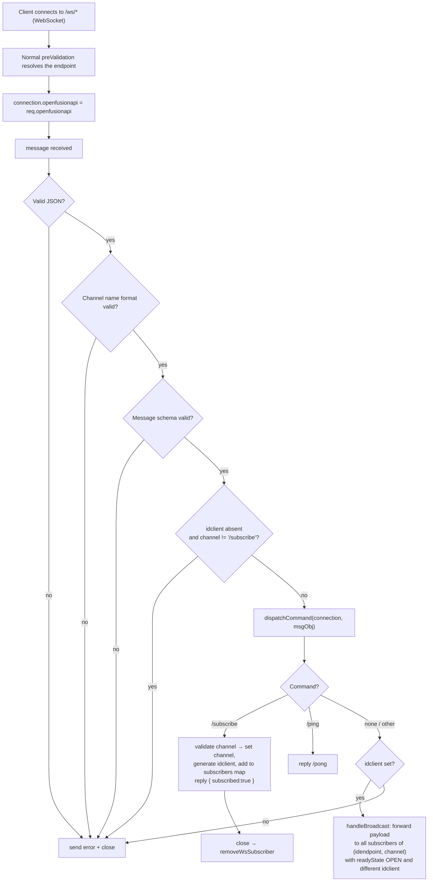
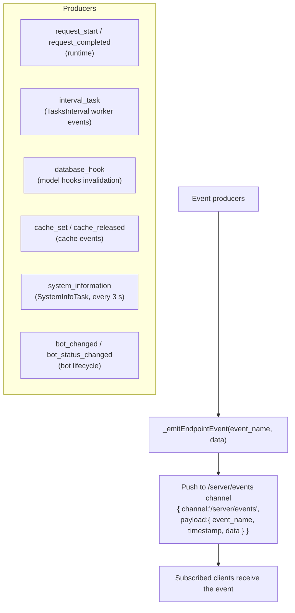

# Real-time Flows

- [1. WebSocket client connection & messaging](#1-websocket-client-connection--messaging)
- [2. Server events pushed to subscribers](#2-server-events-pushed-to-subscribers)

Source references: `src/lib/server/websocket_manager.js`, `src/lib/server/websocket_client.js`,
`src/lib/index.js`.

---

## 1. WebSocket client connection & messaging



Format of an outgoing broadcast message:

```json
{ "channel": "<channel-name>", "sendFrom": "<idclient>", "payload": { } }
```

---

## 2. Server events pushed to subscribers

The server maintains an internal WebSocket client that subscribes to the `/server/events`
channel. Any `_emitEndpointEvent(event_name, data)` forwards to that channel; browser clients
subscribed to the same channel receive them.



| Event(s) | Producer | Payload highlights |
|---|---|---|
| `request_start`, `request_completed` | EndpointRequestFlowService | endpoint metadata, statusCode, responseTime |
| `interval_task` | timer worker via TasksInterval | task id, status (RUNNING/DONE/ERROR/TIMEOUT), duration |
| `database_hook` | model hooks | model/table changed |
| `cache_set`, `cache_released` | cache | app/resource/key |
| `system_information` | SystemInfoTask | only when >1 WS client connected |
| `bot_changed`, `bot_status_changed` | bot manager / lifecycle | bot id, runtime_status, failure info |