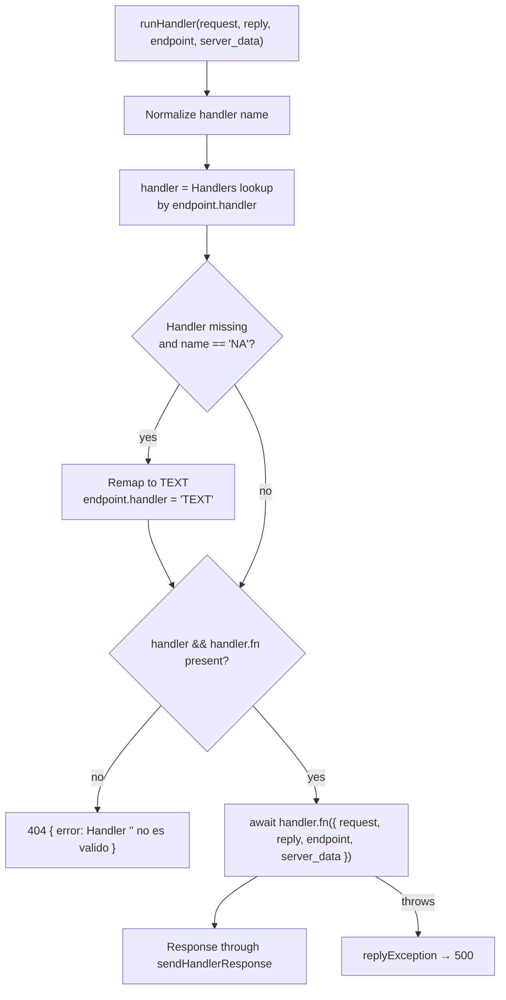
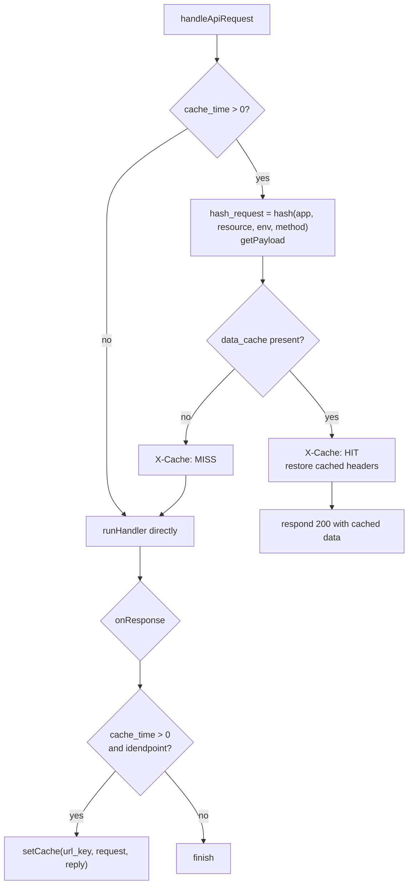
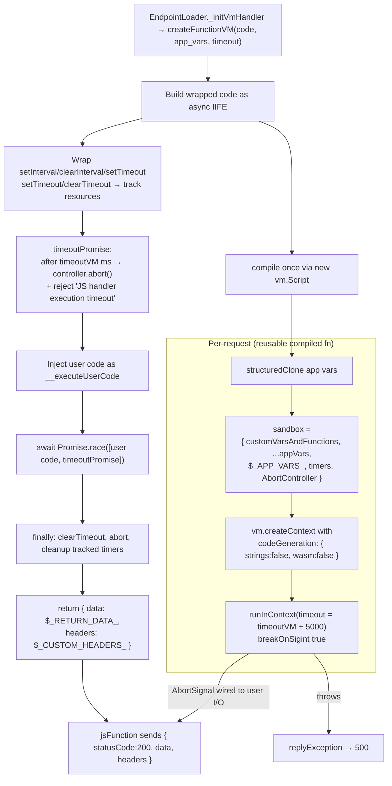
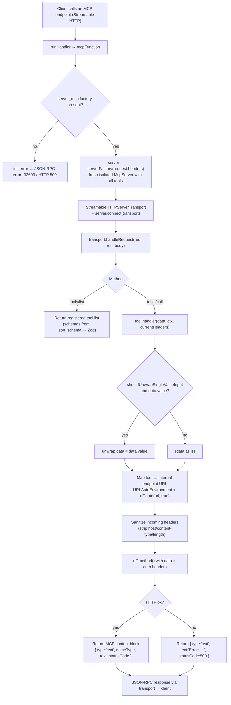

# Runtime & Handler Flows

- [1. Handler dispatch](#1-handler-dispatch)
- [2. Cache (HIT / MISS)](#2-cache-hit--miss)
- [3. JS handler sandbox](#3-js-handler-sandbox)
- [4. MCP handler invocation](#4-mcp-handler-invocation)

Source references: `src/lib/handler/handler.js`, `src/lib/handler/*`,
`src/lib/server/createFunctionVM.js`, `src/lib/server/endpoint/handlerBuild/mcp.js`,
`src/lib/handler/mcpFunction.js`.

---

## 1. Handler dispatch

Handler table (keys of the `Handlers` map):

| Key | Handler | Implementation |
|---|---|---|
| `JS` | JavaScript | `jsFunction` — sandboxed VM (see §3) |
| `FETCH` | Fetch | `fetchFunction` — HTTP proxy (uFetch) |
| `SOAP` | SOAP | `soapFunction` — SOAP→REST |
| `SQL` | SQL | `sqlFunction` — Sequelize |
| `SQL_BULK_I` | SQL Bulk Insert | `sqlFunctionInsertBulk` |
| `HANA` | HANA | `sqlHana` — SAP HANA client |
| `TEXT` | Text | `textFunction` — static content |
| `FUNCTION` | Function | `customFunction` — registered server fn |
| `MONGODB` | MongoDB | `mongodbFunction` |
| `MCP` | MCP | `mcpFunction` — MCP server (see §4) |
| `NA` | Not Assigned | remapped to TEXT at runtime |

---

## 2. Cache (HIT / MISS)

---

## 3. JS handler sandbox

> The sandbox disables `eval`/`new Function`/WASM (`codeGeneration` off). A dual timeout guards
> execution: the in-VM `Promise.race` (AbortSignal) and a VM-level hard timeout with 5 s slack.

---

## 4. MCP handler invocation

> MCP tools are built only from endpoints with `mcp.enabled === true` (non-WS, non-MCP
> handler). The catalog tools `list_api_endpoints_*` and the handler/library skill tools
> (`get_handler_skill`, `validate_json_schema_for_mcp`) are registered alongside them.